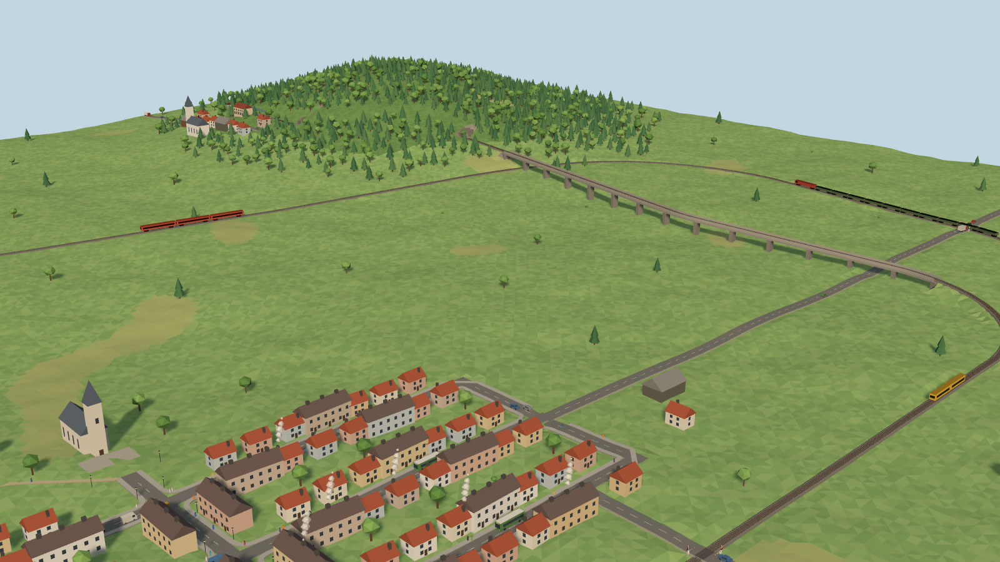
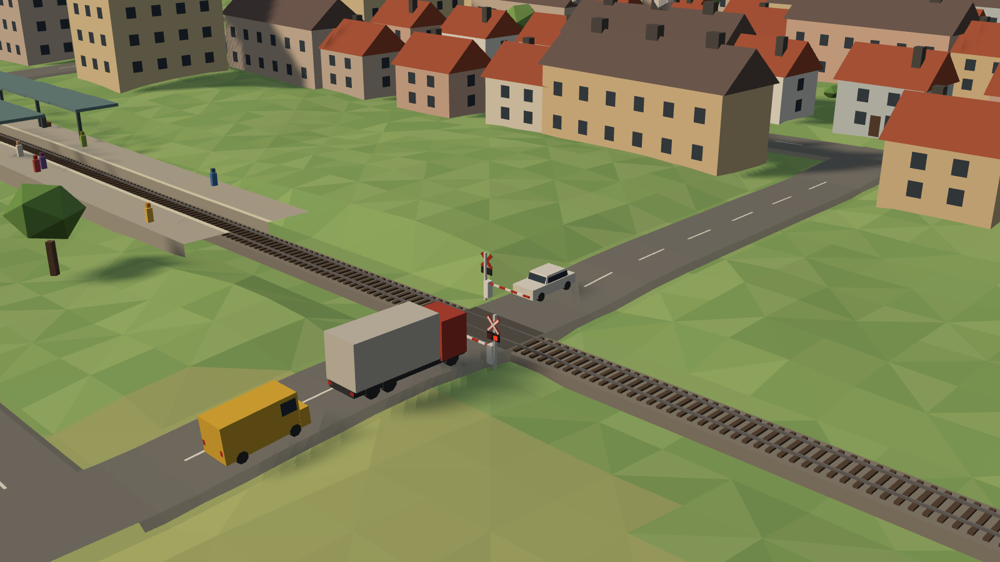
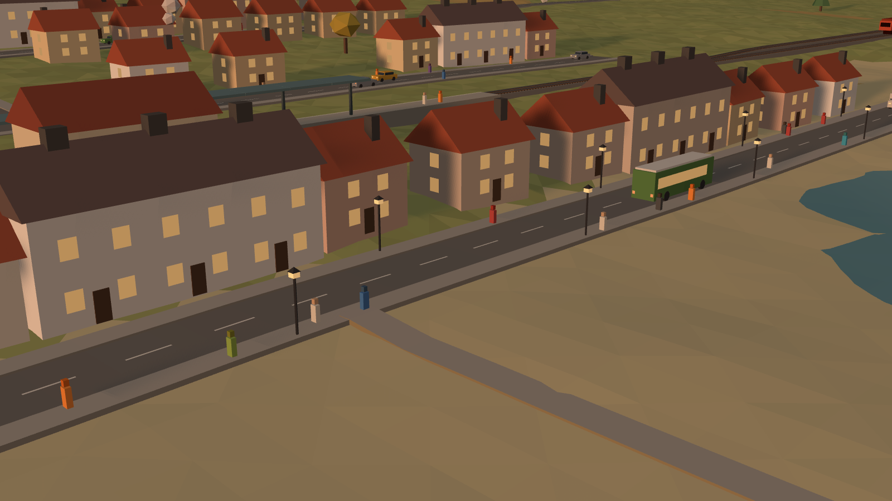
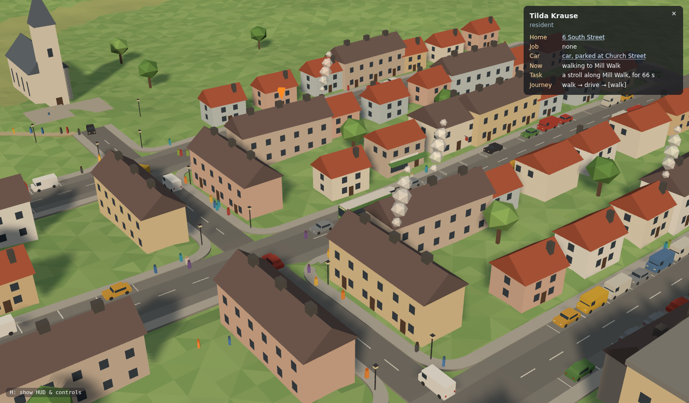
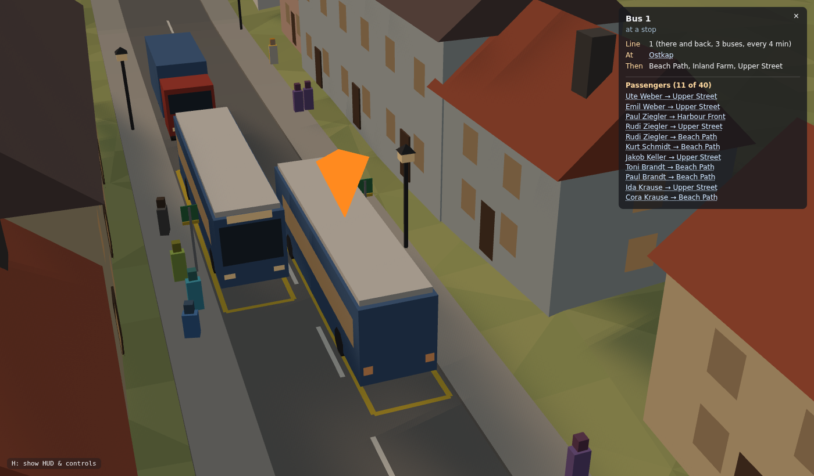
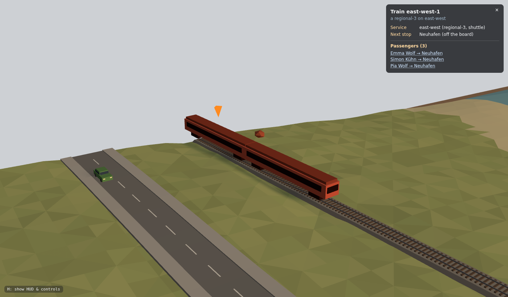
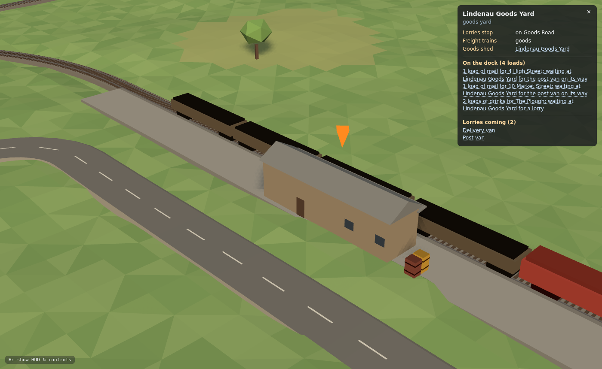

# Diorama Rail

A model railway to watch in the browser: low-poly terrain, track, stations,
roads, footpaths, buildings and trees on a diorama block, with trains running on
their own and a town that lives around them. Every resident has a name, a home,
often a job and perhaps a car, and runs errands — to work, home, the shops, a
stroll — walking, driving from parking bay to parking bay, or taking the train
or the bus, whichever is quickest. The board is a piece of a bigger world: lines
that run off its edge lead to towns beyond, where trains and buses call and
people go to work, out of sight, and come back. Goods move too: farms, shops,
homes and the towns beyond send and need food, mail and goods, carried by
delivery vans and lorries and by freight trains through goods yards. Click anyone
(or any building, vehicle, train, bus stop or goods yard) to see who they are and
what they are doing. A layout is one JSON file; everything visible is derived
from it plus a seed — including its scenery objects, which are themselves small
JSON models built from primitives. Layouts and objects can be validated, simulated and screenshotted
from the command line, so an LLM (or you) can write and repair them in a loop.



**Try it in your browser — nothing to install:**
**[deveringham.github.io/diorama-rail](https://deveringham.github.io/diorama-rail/)**
(works on a phone or tablet too). Pick a layout from the list in the top-left
corner; drag to look around, scroll or pinch to zoom, and click or tap anyone or
anything to see what they are doing. The buttons beside the list pause the
trains, speed them up, ride along with one, change the graphics settings (for a
smoother picture on a slow computer or phone), and show the controls.

## Quick start

```sh
npm install
npm run dev                      # http://localhost:5173/?layout=valley-loop
```

Open `?layout=harbour-town` for the second example (an unknown name lists the
available layouts and suggests the closest one). Edit a file in `layouts/` while
`npm run dev` is running and the page rebuilds the world in place (camera kept).
Layout errors appear in a red panel.

URL parameters: `layout=<name>` (file in `layouts/`), `seed=N` (override the
seed), `t=SECONDS` (pre-run the simulation), `view=overview|top|follow`, `shot=1`
(screenshot mode), `cam=x,y,z,tx,ty,tz` (eye and target in model metres),
`object=<id>[,<id>…]` or `object=*` (preview scenery objects alone, with
`season=summer|autumn|winter`), `quality=low|medium|high` (graphics preset for
this visit, see [Graphics settings](#graphics-settings)).

### Controls

The buttons in the top-left corner switch layout, pause and resume, set the
speed (1×, 2×, 4×), follow a train (again for the next, "Stop following" to look
around freely), open the graphics settings and show the HUD. The HUD in the bottom-left corner shows the
layout, simulated time, fps, draw calls and triangles, and this list of controls
with the current state of each (shown by default on a wide screen; on a phone,
behind the `?` button). On a touch screen: one finger orbits, a pinch zooms, two
fingers pan, a tap inspects.

| Key | Action |
|---|---|
| mouse | orbit (drag), zoom (wheel), pan (right-drag) |
| `Space` | pause / resume |
| `1` `2` `3` | time scale 1×, 2×, 4× |
| `F` | follow the next train; `Esc` stops following |
| `S` | shadows off, or back on as they were (static or full) |
| `G` | graphics settings |
| `H` | hide / show the HUD (shown by default on a wide screen; hidden in screenshots) |
| `R` | auto-rotate on/off |
| click | inspect a person, building, car, bus, delivery van, train, bus stop or goods yard (names in the panel are links); `Esc` closes |

In the browser console, `dr` holds the API plus `world`, `sim`, `scene`,
`renderer`, `camera` and `inspector`, e.g. `dr.query(dr.world).describe()` or
`dr.describePerson(dr.sim, 12)`; `dr.graphics()` and `dr.setGraphics("low")` (or
`dr.setGraphics({ shadows: "static" })`) read and change the graphics settings.

### Graphics settings

The **Graphics** button (or `G`) opens a panel with a preset and six settings, the
frame rate and triangle count beside them so the effect shows at once. The choice is
remembered in the browser (`localStorage`); `?quality=low|medium|high` overrides it
for one visit.

| Setting | Choices | What it costs, what it saves |
|---|---|---|
| Resolution | 50%, 75%, 100% | pixels drawn, relative to the default (the screen's own, up to 1.5× on a high-density screen); the main saving on a weak graphics chip driving a big or sharp screen |
| Smooth edges | off, on | multisampled antialiasing: on a weak chip it can cost as much as everything else together; switching starts a fresh WebGL context |
| Shadows | off, static, full | *full*: everything casts a shadow, redrawn every frame; *static*: buildings, trees, bridges and structures only, redrawn each time the sun has moved ¾° (every 3 s in a 24-minute day; never when time stands still), so most frames draw no shadow pass at all |
| Shadow detail | low, medium, high | shadow map 1024², 2048², 4096² |
| Small things | near, mid, all | how far out things under 3 m (lamp posts, benches, bushes, sleepers, people and, by day, windows) are drawn: *mid* leaves out whatever would be under 1.5 px tall, *near* under 3 px; trees and buildings always show, and so do lit windows |
| Frame rate | unlimited, 30 fps | a cap keeps a slow machine steady and cool rather than faster |

| Preset | Resolution | Smooth edges | Shadows | Shadow detail | Small things |
|---|---|---|---|---|---|
| High | 100% | on | full | medium | all |
| Medium | 100% | on | static | medium | mid |
| Low | 75% | off | off | — | near |

**Auto** (the default until a preset or setting is picked) starts at High, or at Low
on a software renderer, and steps down a preset whenever the median frame rate
stays below 40 fps for two 3-second spells in a row, with a note at the bottom of
the screen; it never steps back up by itself. Screenshots draw at High unless
`--quality` says otherwise. [docs/PERFORMANCE.md](docs/PERFORMANCE.md) has the
measurements behind all this.

## Publishing the site

`.github/workflows/pages.yml` builds the app and publishes it on GitHub Pages
every time `main` changes (or on demand: Actions → "Publish to GitHub Pages" →
Run workflow). It needs switching on once: in the repository's Settings → Pages,
set Source to "GitHub Actions". The build uses relative paths (`base: "./"` in
`vite.config.ts`), so `dist/` works from any folder of any static host, and every
file in `layouts/` is published and offered in the layout list (names starting with `_` are left out of the list).

## Command line

```sh
npm run check -- layouts/valley-loop.json [--json]          # validate; exit 1 on errors
npm run simulate -- layouts/valley-loop.json --minutes 30   # per-service stops, speed, waits; traffic; buses; people; freight; exit 1 on deadlock
npm run screenshot -- layouts/valley-loop.json --out shot.png --t 120 --view top --size 1600x1000
npm run screenshot -- layouts/valley-loop.json --object windmill --out mill.png     # one object alone
npm run screenshot -- layouts/valley-loop.json --object all --season winter         # every object
npm run screenshot -- layouts/spreeviertel.json --quality low                       # a graphics preset (default high)
npm run bench -- layouts/spreeviertel.json                  # ms per frame, draw calls, triangles at each preset
npm run schema                                              # writes docs/schema.json
npm test                                                    # vitest: geometry, validation, sim invariants
npm run typecheck
```

`screenshot` builds the app, serves it with `vite preview` on a free port (or
uses `--url http://localhost:5173` to reuse a running dev server), renders in
headless Chromium with SwiftShader WebGL and prints draw calls and triangles.
Layout files outside `layouts/` work too. With `--object` it renders just those
scenery objects (built-in and the layout's own) on a small plinth, labelled.
The same preview is live in the browser at `?layout=valley-loop&object=*`.

Writing layouts: read [docs/LAYOUT_GUIDE.md](docs/LAYOUT_GUIDE.md) — coordinates,
roads, parking and traffic, sidewalks and paths, buildings and people, buses,
lines off the board, freight and deliveries, placing scenery, designing objects,
rules of thumb, every validation code with a fix, and the authoring loop.

## How it fits together

```
layout.json ─► model/  parse (zod) → refs → track geometry (fillets, junctions) → heights,
                 │     bridges/tunnels → roads (junctions, crossroads, level crossings, heights)
                 │     (car parks as aisle roads) → paths and sidewalks (the walk network: zebras,
                 │     foot crossings, station ends) → terrain shaping → conflicts, stations,
                 │     exits and off-layout places → routes → bus stops → scenery → town (buildings, doors,
                 │     parking bays, residents)
                 │     → bus lines (routes over the lanes) → freight (yards, docks, the fleet)
                 ├───► sim/    blocks, per-service plans, trains, level crossings, road traffic,
                 │             parked cars, buses and delivery vans, journey planner, people and their
                 │             errands, freight (orders, consignments, jobs), fixed 1/30 s step,
                 │             deadlock check; describe.ts for the inspect panel
                 └───► scene/  three.js meshes built once; trains (and their loads), vehicles, barriers,
                               people, crates, smoke, light updated per frame; small things culled
                               by distance; graphics settings (quality.ts, qualityMenu.ts)
cli/ check | simulate | schema | screenshot        api.ts: the stable public API (also window.dr)
```

`model/` and `sim/` never import three.js or touch the DOM, so they run in Node.
Model coordinates are metres, x east, y north, z up; `scene/geo.ts` `toThree()` is
the only place they meet three.js's y-up frame.

## Extending

**A new train type** — add an entry to `TRAIN_CATALOG` in `src/model/catalog.ts`:

```ts
"intercity-4": { cars: 4, carLength: 26, carWidth: 3, carHeight: 4, maxSpeed: 40,
                 accel: 0.7, decel: 0.9, color: "#5a7fa8", shape: "multiple-unit" },
```

Use it as a service's `train`. Meshes come from `shape` (`multiple-unit`,
`loco-hauled`, `tram`, `freight`); `locoLength` sets a different first vehicle.
Run `npm run schema` so the schema description lists it.

**A new building, tree or other object** — describe it as parts in the layout's
`objects` and place it in `scenery`; no code changes:

```jsonc
"objects": { "kiosk": { "tint": ["#3d7d8c"], "parts": [
  { "shape": "box", "size": [3, 2, 2.4] },
  { "shape": "pyramid", "at": [0, 0, 2.4], "size": [3.6, 2.6, 0.8], "color": "roof" } ] } },
"scenery": [ { "object": "kiosk", "at": [700, 215], "face": "track" } ]
```

Preview it with `npm run screenshot -- my.json --object kiosk`. To make it
available to every layout, add the same entry to `src/model/objectLibrary.ts`.

Give it a `building` block (`functions`, `residents`, `jobs`, `titles`, `kind`,
`door`) and every placement becomes a building people live in, work at or visit.

**A new vehicle** — it is an object too: define it (front toward +x, origin at
its centre, `lamp`-coloured parts for headlights) and list it in the layout's
`traffic.vehicles` (through traffic) or `people.vehicles` (residents' cars), e.g.
`"traffic": { "vehicles": ["van", "tractor"] }`.

**A new validation rule** —
1. `src/model/validate.ts`: write `checkSomething(...)` returning `Issue[]` built
   with `error(code, message, path, at?)` or `warning(...)`.
2. `src/model/build.ts`: call it where its inputs exist, e.g.
   `issues.push(...checkSomething(layout, tracks));`.
3. Add the code to `docs/LAYOUT_GUIDE.md` §12 and a failing fixture to
   `test/validate.test.ts`.

## Notes on v0.1

### Changes to the spec's `valley-loop`
The spec's layout did not validate as written, so it was adjusted minimally:

- `hill` ended at `z: 30`, which needs a 3.9% climb over its 738 m (max 3.5%,
  `GRADE_EXCEEDED`). The end height is now `z: 26`.
- With the original last waypoint `[1060, 880]` the line cut under the hill's
  shoulder all the way to its end, so the whole end — and Bergdorf — lay in the
  tunnel. The last waypoint is now `[1030, 890]` with an extra waypoint
  `[1030, 750]`: the line tunnels under the shoulder (140 m), emerges, and ends
  on a 93 m straight in the open.
- `bergdorf` moved from `at: 520` (inside the tunnel, on a curve) to `at: 722`,
  on that final straight.

The intent is kept: an oval round a valley, a branch climbing to a hill village
through a tunnel (and, as a bonus, crossing the main line on a viaduct), three
services and two towns. Bergdorf's platform is on the west (`left`) side, where
the hillside is level with the track.

### Scenery: objects instead of towns and forests
The spec's procedural `towns`, `forests` and `scatterTrees` are replaced by
explicit scenery: every building and tree is an object (a JSON model of
primitive parts), placed one by one or scattered over an area. Built-in objects
live in `src/model/objectLibrary.ts`; a layout can add or override objects in
its `objects` section. Both example layouts now lay out their towns along their
roads and define a few objects of their own (windmill, hay bale, lighthouse,
fishing boat).

### Roads and traffic



Roads are a network of their own, built like the track (`src/model/roads.ts`):
filleted waypoints, heights that follow the smoothed ground within `maxGrade`
(a waypoint `z` pins one point), bridges, tunnels and terrain shaping, T-junctions
and corners via `from`/`to`, crossroads wherever two roads cross at about the
same height, and level crossings wherever a road meets a track within 3 m of its
height. A road has one lane each way or more (`lanes`), and junctions may have
traffic lights (`trafficLights`). The sim (`src/sim/traffic.ts`) drives vehicles
on the right:

- Cars follow the car ahead (a time gap plus a minimum distance), slow for
  curves and turns, and choose turns at random. At a junction a car goes only
  when there is room beyond it, so cars never block one, and when nobody is
  driving a way across it that crosses or touches its own — judged by the sweep
  of a bus's body through each turn — first come, first served: cars side by
  side, or coming straight toward each other, go together. Nor do they stop on a
  level crossing. Roads that end on the board's edge lead off it (cars drive off
  and come back); at other dead ends cars turn round.
- On a road of several lanes each way, cars turn right from the lane by the
  kerb, left from the one by the centre line and go straight on from any; they
  move across into the lane their next turn needs when there is a gap (the car
  behind lets in one that waits, and one kept waiting at a junction in the wrong
  lane for long takes another way). Buses, delivery vehicles and cars going into
  a bay keep to the lane by the kerb; others pass them.
- Traffic lights give opposite roads a green together and the others in turn:
  a green lasts while cars keep coming and someone waits on red (6 s to `green`,
  default 20 s), then amber and red all round until the junction is clear; with
  nobody waiting elsewhere it stays green. Cars go on green, and on amber only
  when too close to stop.
- A level crossing starts flashing when a train could arrive within about 11 s
  (a pessimistic estimate: the line's speed limits, accelerating from its
  current speed, after any remaining dwell) or is too close to brake comfortably,
  lowers its barriers once no car is on it, and opens when the tail has passed.
  Trains stop short of a crossing that is not closed — a safety net that the
  examples never need.
- Crossings close together on one road (a road over double track) work as one:
  they flash, close and open together, with barriers only outside the group.
- Limitations: no right of way between junction approaches beyond first come,
  first served (a car kept waiting because its way out is full takes another);
  no overtaking on roads of one lane each way, and no pedestrian phase at
  traffic lights (people wait for a gap); vehicles are rigid boxes, so at the
  tightest corners a long bus may brush a car waiting at the line.

### Sidewalks, paths and people



Roads can have sidewalks (`sidewalks: "both" | "left" | "right"`), and a layout's
`paths` are footpaths built like roads (`src/model/walks.ts`): filleted
waypoints, heights within `maxGrade`, bridges and tunnels, T-junctions via
`from`/`to` (on another path, or at a road's edge, joining its sidewalk) and
automatic junctions. Together they form one walk network: sidewalks round the
corners of road junctions and across their legs, zebra crossings where a path
crosses a road, foot crossings (lights and a barrier) where a path crosses a
track, and piers where a path runs out over the sea. People walk it:

- They keep right at their own pace.
- At a zebra they wait at the kerb until every car coming can stop (cars stop for
  anyone on it or waiting); if a car has waited a few seconds they let it through.
  Over a junction's leg (unmarked) they wait for a gap, and after a while step out
  in front of cars that can still stop. At level and foot crossings they wait
  while the lights flash, and the barriers only come down once nobody is in the
  way.
- People do not avoid each other on a walkway (they pass through one another
  when overtaking); that, and the one-person-wide way they queue at a kerb, are
  the visible simplifications.

### Buildings, people and their errands



`src/model/town.ts` turns every placed object with a `building` block into a
building — an address (its `name`, or a number on the nearest street, odd on the
left), its uses (accommodation, workplace, landmark), homes and job titles, and
a door joined to the nearest walkway by a straight link that crosses no road or
track — and lays out the parking bays (street parking strips; car parks, which
are dead-end aisle roads of their own). It then houses the residents: names and
households, jobs at the workplaces, and cars parked near home.

`src/sim/people.ts` gives them errands. Someone with nothing to do thinks of a
task (work, home, a visit, a stroll), and `src/sim/planner.ts` finds the quickest
journey in one search over walkways (split where doors, bays, stations and
strolling spots join them), road lanes, train services and bus lines (with the
expected wait), with a layer for "car still parked / driving / car parked again" so a car
is picked up once and only where it stands. Then they follow it:

- On foot, with the kerb and level-crossing behaviour above.
- By car (`src/sim/traffic.ts`): the goal bay is reserved, the car pulls out when
  there is a gap (backing out of nose-in bays), drives the planned lanes with the
  rest of the traffic (rerouting if a junction stays blocked), and turns into its
  bay. The owner gets out and walks on. Each car stays where it was parked, so a
  car left at the station is collected on the way back.
- By train: people walk on to the platform (through the station building, at the
  end of a path, or from the nearest walkway; both platforms of a two-sided
  station), wait, board the first train of a suitable service heading their way,
  and get off at their stop. Each train keeps its passenger list.
- By bus: people walk to the stop, wait on the sidewalk by its sign, get on the
  first bus of a line that calls at their destination stop (if it has room), and
  get off there. Each bus keeps its passenger list.

At the destination they go inside for the task's duration (or linger at the
spot), then think of the next thing. `src/sim/describe.ts` turns all of this into
the panel shown when you click something. Durations are compressed for a diorama
(work lasts minutes, not hours). Through traffic (`traffic.cars`) still drives
about at random and is not driven by residents. Cars glide into parallel bays
rather than reversing in, and people do not avoid each other on walkways.

### Buses



`busStops` stand beside roads (`side`: left, right or both), and `busLines` call
at them in order, there and back or round a loop (`src/model/buses.ts`). Each
line's route is found over the same lanes the traffic drives: buses drive on the
right, so they call at the side of a stop on their right, and the side chosen at
each stop is the one that makes the quickest round (preferring sides people can
walk to, and on a shuttle's way back the side it did not use on the way out).
Stops that would leave a waiting bus blocking a junction or a crossing, and lines
no road connects, are errors; each stop gets a painted box, a sign and, where
there is room, a shelter, and parked cars keep clear of it.

In the sim the buses are vehicles in the traffic (`src/sim/traffic.ts`) that go
round their line's itinerary and stop in their lane at each stop — the traffic
behind waits — for the line's dwell, longer while people get on and off, and a
bus that has caught up with the one ahead waits a little longer so they stay
apart. The planner treats a line like a train service: an edge from each side of
a stop to every later one, costed with half the headway as the expected wait.
Buses stop in the lane (there are no lay-bys), and turn round at dead ends or off
the board's edge.

### Off the board



A track, road or footpath line whose first or last waypoint is on the board's
edge leaves the board there (`src/model/exits.ts`); `offLayout` places lie beyond
such exits at given distances, with jobs for the residents and an appeal for
visits. Nothing out there is drawn, but everything is still simulated:

- **Trains** (`src/sim/trains.ts`): a shuttle whose route ends where its track
  leaves the board runs off the edge instead of turning at its last platform; a
  loop whose first and last tracks cross the edge runs through, off at the end
  and back on at the start. Once the tail is past the edge the train hands back
  its blocks and is off the board: it travels on at a steady speed, calls at the
  service's off-layout stops (people get off and on), and comes back on at the
  edge as soon as the first stretch is free, at a speed it can stop from. Level
  crossings near the edge close for a train due back. Cars vanish (and reappear)
  one by one at the edge.
- **Buses** take roads off the board to the line's off-layout stops, call there
  out of sight and come back on; **residents' cars** drive off to an off-layout
  place and stay parked there until driven back; through traffic drives off and
  back.
- **People** may be given a job off the board, or go there on a visit; the
  planner joins each off-layout place to the paths and sidewalks (walked out of
  sight), roads (driven), services and bus lines that reach it, so they leave by
  whatever is quickest, stay there out of sight, and come back by whatever suits
  them later. The inspect panel and `describe()` say where everything is, on the
  board or off it.

### Freight and deliveries



Buildings and off-layout places send out and need goods (`supplies` and
`demands`, loads per hour by goods id: mail, food, goods, drinks, …; the built-in
farm, shops, inns, offices, homes, post office, warehouse and factory come with
some). A station with `"kind": "freight"` is a **goods yard**: a loading dock
beside the track with a goods shed on it and a road along its back, where lorries
load and unload (`src/model/freight.ts`). Each building with freight gets a
*dock* too: the place in a lane at the kerb nearest its door where a delivery
vehicle stops.

In the sim (`src/sim/freight.ts`) sources make stock and consumers order when
their need builds up. Each order goes to a source with goods ready, chosen by how
quickly the goods can come — straight by road, or by road to a yard, by freight
train, and by road from the other end (straight to or from an off-layout place a
freight train calls at) — and travels as consignments, leg by leg. The delivery
fleet (`freight.vehicles`, or a few vans and lorries by default) waits off the
board beyond a road leaving it (or, where none does, drives about like through
traffic) until given a job: collect everything waiting at one place
that fits, then drop off in turn, stopping in the lane at each dock while the
traffic behind waits (`src/sim/traffic.ts`), or driving off the board for an
off-layout place. Freight trains unload at each yard or off-layout stop what is
for there and load what waits for a stop ahead, waiting while the goods are moved.

Crates on the docks (and outside buildings with goods ready to go) and heaps in
the wagons show the goods in their colours; the inspect panel describes a van's
job and load, a freight train's goods, a yard's dock, and what a building sends,
needs and has on its way. `simulate` prints a freight line.

### Interpretations and limitations
- **Fixed routes.** A service follows one path through the graph. Two shuttles
  cannot choose either side of a passing loop, so `harbour-town` uses two
  services (`east-west` on the main line, `west-east` through `passing`) instead
  of one service with `count: 2`. The passing track is drawn east→west so the
  second route starts at the opposite terminus.
- **Single-track safety.** A block is "opposed" for a train when another service
  (or another train of the same shuttle) can run through it the other way.
  Trains reserve a whole opposed stretch plus room to stand clear beyond it in
  one go, which prevents head-on deadlocks on shared single track.
- Because routes are fixed, car positions are computed by walking back along the
  route path rather than via a ring buffer of the head's history.
- **Freight is scheduled, not dispatched.** Freight trains run their services
  like passenger trains and carry whatever waits for a stop ahead; they are not
  sent anywhere on demand. Delivery vehicles stop in the lane (there are no
  loading bays; the traffic behind waits, with no overtaking) and turn round at
  dead ends or off the board's edge; between jobs they wait off the board, or
  wander like through traffic where no road leaves it. On a small, busy network
  they add to the queues at junctions. A goods yard on a single-track main line
  holds up other trains while a freight train stands there, so give yards a
  siding or branch.
- Shuttle ends: the farthest stop on the route's end track (train centred on the
  platform), else the buffer stop; a loop end track without stops turns round
  half a lap from the junction.
- When a track has explicit `z` waypoints, junction heights join them as
  interpolation anchors, so branches ramp evenly instead of climbing at once.
- Terrain `features` are Gaussian bumps `height·exp(−3·(d/radius)²)` (5% left at
  `radius`).
- The terrain mesh receives but does not cast shadows (it would double its
  175k-triangle cost); trees, buildings, structures and trains cast them.
- The renderer's triangle count includes the shadow pass. At High both examples
  render in about 90–100 draw calls and 410–450k triangles (shadow pass included),
  at Medium and Low about 50 and 300k; see [docs/PERFORMANCE.md](docs/PERFORMANCE.md). Each object
  type in use costs 1–2 instanced draw calls (its body, with fixed and tinted
  parts told apart by a per-vertex mask, and its glowing windows), however many
  times it is placed; vehicles likewise per type.
- Turnouts are drawn as overlapping track; no signals, sound or timetables.
